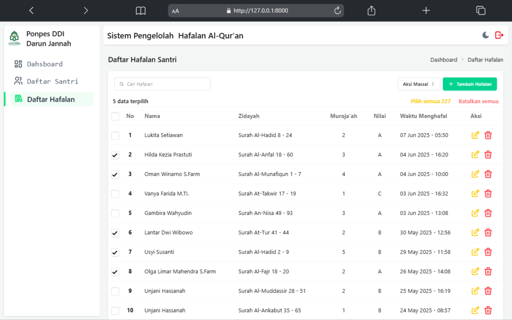

# 🕌 Rumah Tahfidz

**Rumah Tahfidz** is a simple Laravel-based web application designed to record and manage Qur’an memorization (*hafalan*) of students (*santri*) in a *rumah tahfidz* (Islamic boarding school).

This application is intended for single-user (admin-only) access to easily manage student data and their memorization records in a structured way.

---

## ✨ Features

- 🔐 Admin-only login access
- 👤 Add, edit, and delete student records
- 📖 Record Qur’an memorization by surah and verses
- ⚡ Interactive UI powered by Livewire and Alpine.js
- 🎨 Responsive and modern design using Tailwind CSS and DaisyUI

---

## 📸 Screenshots

#### ☀️ Light Mode

| Login | Hifz | Student |
|-------|------|---------|
|  |  |  |

See other screenshots in the [docs/preview/light](docs/preview/light) directory.

#### 🌙 Dark Mode

| Login | Hifz | Student |
|-------|------|---------|
|  |  |  |

See other screenshots in the [docs/preview/dark](docs/preview/dark) directory.

---

## 🛠️ Tech Stack

- [Laravel](https://laravel.com/)
- [Livewire](https://livewire.laravel.com/)
- [Tailwind CSS](https://tailwindcss.com/)
- [Alpine.js](https://alpinejs.dev/)
- [DaisyUI](https://daisyui.com/)
- [Bun](https://bun.sh/) — used as a replacement for Node.js

---

## ⚙️ Installation

```bash
# Clone the repository
git clone https://github.com/AhmadIkbalDjaya/rumah-tahfidz.git
cd rumah-tahfidz

# Install backend dependencies
composer install

# Install frontend dependencies using Bun
bun install

# Setup environment file
cp .env.example .env
php artisan key:generate

# Run database migrations and seeders
php artisan migrate --seed
php artisan db:seed --class=DevSeeder

# Start the local server
php artisan serve

# Run the frontend development server
bun run dev
```
 
## 🗃️ Database Design
Below is the database design for the rumah tahfidz project:
